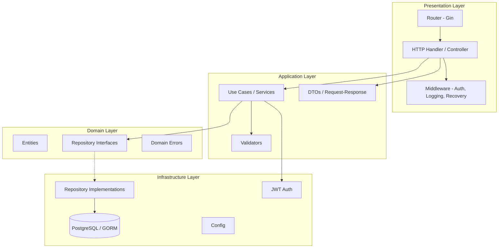

# Dự án Quản lý Nhật ký - Clean Architecture & CI/CD

Xây dựng hệ thống quản lý nhật ký (diary/journal) bằng Golang, áp dụng Clean Architecture và Design Patterns, tích hợp CI/CD với GitHub Actions.

## User Review Required

> [!IMPORTANT]
> **Ngôn ngữ & Framework**: Dự án sử dụng **Golang** với **Gin** (HTTP framework), **GORM** (ORM), **PostgreSQL** (database). Nếu bạn muốn dùng framework/DB khác, vui lòng cho biết.

> [!IMPORTANT]
> **Scope của dự án**: Bao gồm CRUD nhật ký, authentication (JWT), phân trang, tìm kiếm. Bạn có muốn thêm tính năng nào khác không?

## Kiến trúc tổng quan



## Design Patterns được sử dụng

| Pattern | Mục đích | Vị trí áp dụng |
|---------|----------|-----------------|
| **Repository Pattern** | Tách biệt data access khỏi business logic | `internal/repository/` |
| **Factory Pattern** | Tạo entities với validation | `internal/domain/entity/` |
| **Strategy Pattern** | Hỗ trợ nhiều loại search/filter | `internal/usecase/` |
| **Dependency Injection** | Giảm coupling giữa các layer | Constructor injection toàn bộ |
| **Middleware Pattern** | Xử lý cross-cutting concerns | `internal/delivery/middleware/` |
| **Builder Pattern** | Xây dựng query phức tạp | `internal/repository/` |
| **DTO Pattern** | Chuyển đổi data giữa các layer | `internal/delivery/dto/` |
| **Singleton Pattern** | Database connection, Config | `internal/infrastructure/` |

## Proposed Changes

### Cấu trúc thư mục

```
demo_he_thong_va_tich_hop_CI_CD/
├── .github/
│   └── workflows/
│       ├── ci.yml                    # CI pipeline: lint, test, build
│       └── cd.yml                    # CD pipeline: build & push Docker image
├── cmd/
│   └── server/
│       └── main.go                   # Entry point
├── internal/
│   ├── domain/                       # Domain Layer (innermost)
│   │   ├── entity/
│   │   │   ├── user.go
│   │   │   └── diary.go
│   │   ├── repository/
│   │   │   ├── user_repository.go    # Interface
│   │   │   └── diary_repository.go   # Interface
│   │   └── errors/
│   │       └── errors.go
│   ├── usecase/                      # Application/Use Case Layer
│   │   ├── user_usecase.go
│   │   ├── diary_usecase.go
│   │   └── dto/
│   │       ├── user_dto.go
│   │       └── diary_dto.go
│   ├── repository/                   # Infrastructure - Repository Impl
│   │   ├── user_repository_impl.go
│   │   └── diary_repository_impl.go
│   ├── delivery/                     # Presentation Layer
│   │   └── http/
│   │       ├── handler/
│   │       │   ├── user_handler.go
│   │       │   └── diary_handler.go
│   │       ├── middleware/
│   │       │   ├── auth_middleware.go
│   │       │   ├── cors_middleware.go
│   │       │   └── logger_middleware.go
│   │       └── router/
│   │           └── router.go
│   └── infrastructure/
│       ├── config/
│       │   └── config.go
│       ├── database/
│       │   └── postgres.go
│       └── auth/
│           └── jwt.go
├── pkg/
│   ├── response/
│   │   └── response.go              # Standard API response
│   └── validator/
│       └── validator.go
├── migrations/
│   └── 001_init.sql
├── Dockerfile
├── docker-compose.yml
├── Makefile
├── .env.example
├── go.mod
├── go.sum
└── README.md
```

---

### Domain Layer

#### [NEW] [user.go](file:///d:/Chuong_Trinh_Dao_Tao/Golang/demo_he_thong_va_tich_hop_CI_CD/internal/domain/entity/user.go)
- Entity `User` với fields: ID, Username, Email, Password, CreatedAt, UpdatedAt
- Factory method `NewUser()` với validation

#### [NEW] [diary.go](file:///d:/Chuong_Trinh_Dao_Tao/Golang/demo_he_thong_va_tich_hop_CI_CD/internal/domain/entity/diary.go)
- Entity `Diary` với fields: ID, UserID, Title, Content, Mood, Tags, IsPrivate, CreatedAt, UpdatedAt
- Factory method `NewDiary()` với validation
- Enum cho Mood (Happy, Sad, Neutral, Excited, Anxious)

#### [NEW] [user_repository.go](file:///d:/Chuong_Trinh_Dao_Tao/Golang/demo_he_thong_va_tich_hop_CI_CD/internal/domain/repository/user_repository.go)
- Interface `UserRepository` với methods: Create, FindByID, FindByEmail, FindByUsername

#### [NEW] [diary_repository.go](file:///d:/Chuong_Trinh_Dao_Tao/Golang/demo_he_thong_va_tich_hop_CI_CD/internal/domain/repository/diary_repository.go)
- Interface `DiaryRepository` với methods: Create, Update, Delete, FindByID, FindByUserID, Search

#### [NEW] [errors.go](file:///d:/Chuong_Trinh_Dao_Tao/Golang/demo_he_thong_va_tich_hop_CI_CD/internal/domain/errors/errors.go)
- Custom domain errors: ErrNotFound, ErrDuplicate, ErrUnauthorized, ErrValidation

---

### Use Case Layer

#### [NEW] [user_usecase.go](file:///d:/Chuong_Trinh_Dao_Tao/Golang/demo_he_thong_va_tich_hop_CI_CD/internal/usecase/user_usecase.go)
- Register, Login, GetProfile
- Password hashing với bcrypt

#### [NEW] [diary_usecase.go](file:///d:/Chuong_Trinh_Dao_Tao/Golang/demo_he_thong_va_tich_hop_CI_CD/internal/usecase/diary_usecase.go)
- CRUD operations cho diary entries
- Search/Filter với Strategy Pattern (by date range, mood, keyword)
- Pagination support

#### [NEW] [user_dto.go](file:///d:/Chuong_Trinh_Dao_Tao/Golang/demo_he_thong_va_tich_hop_CI_CD/internal/usecase/dto/user_dto.go)
- RegisterRequest, LoginRequest, UserResponse

#### [NEW] [diary_dto.go](file:///d:/Chuong_Trinh_Dao_Tao/Golang/demo_he_thong_va_tich_hop_CI_CD/internal/usecase/dto/diary_dto.go)
- CreateDiaryRequest, UpdateDiaryRequest, DiaryResponse, DiaryListResponse, DiaryFilter

---

### Infrastructure Layer

#### [NEW] [postgres.go](file:///d:/Chuong_Trinh_Dao_Tao/Golang/demo_he_thong_va_tich_hop_CI_CD/internal/infrastructure/database/postgres.go)
- Kết nối PostgreSQL qua GORM (Singleton Pattern)
- Auto migration

#### [NEW] [config.go](file:///d:/Chuong_Trinh_Dao_Tao/Golang/demo_he_thong_va_tich_hop_CI_CD/internal/infrastructure/config/config.go)
- Load config từ environment variables
- Sử dụng `viper`

#### [NEW] [jwt.go](file:///d:/Chuong_Trinh_Dao_Tao/Golang/demo_he_thong_va_tich_hop_CI_CD/internal/infrastructure/auth/jwt.go)
- JWT token generation & validation

#### [NEW] Repository implementations
- `user_repository_impl.go` - GORM implementation
- `diary_repository_impl.go` - GORM implementation với Builder Pattern cho query

---

### Delivery Layer (HTTP)

#### [NEW] Handlers
- `user_handler.go` - Register, Login, Profile endpoints
- `diary_handler.go` - CRUD + Search endpoints

#### [NEW] Middleware
- `auth_middleware.go` - JWT authentication
- `cors_middleware.go` - CORS handling
- `logger_middleware.go` - Request logging

#### [NEW] [router.go](file:///d:/Chuong_Trinh_Dao_Tao/Golang/demo_he_thong_va_tich_hop_CI_CD/internal/delivery/http/router/router.go)
- Route registration với Gin

---

### CI/CD với GitHub Actions

#### [NEW] [ci.yml](file:///d:/Chuong_Trinh_Dao_Tao/Golang/demo_he_thong_va_tich_hop_CI_CD/.github/workflows/ci.yml)
Pipeline CI chạy khi push/PR vào `main` và `develop`:
1. **Lint** - golangci-lint
2. **Test** - go test với coverage report
3. **Build** - go build kiểm tra compile
4. **Security** - gosec scan

#### [NEW] [cd.yml](file:///d:/Chuong_Trinh_Dao_Tao/Golang/demo_he_thong_va_tich_hop_CI_CD/.github/workflows/cd.yml)
Pipeline CD chạy khi push tag hoặc merge vào `main`:
1. **Build Docker image**
2. **Push to Docker Hub / GHCR**
3. **Deploy notification**

---

### DevOps Files

#### [NEW] [Dockerfile](file:///d:/Chuong_Trinh_Dao_Tao/Golang/demo_he_thong_va_tich_hop_CI_CD/Dockerfile)
- Multi-stage build (builder + runtime)
- Distroless base image cho security

#### [NEW] [docker-compose.yml](file:///d:/Chuong_Trinh_Dao_Tao/Golang/demo_he_thong_va_tich_hop_CI_CD/docker-compose.yml)
- App service + PostgreSQL service
- Volume cho persistent data

#### [NEW] [Makefile](file:///d:/Chuong_Trinh_Dao_Tao/Golang/demo_he_thong_va_tich_hop_CI_CD/Makefile)
- `make run`, `make test`, `make lint`, `make build`, `make docker-up`

---

## API Endpoints

| Method | Endpoint | Mô tả | Auth |
|--------|----------|--------|------|
| POST | `/api/v1/auth/register` | Đăng ký tài khoản | ❌ |
| POST | `/api/v1/auth/login` | Đăng nhập | ❌ |
| GET | `/api/v1/auth/profile` | Xem profile | ✅ |
| POST | `/api/v1/diaries` | Tạo nhật ký mới | ✅ |
| GET | `/api/v1/diaries` | Danh sách nhật ký (có phân trang, filter) | ✅ |
| GET | `/api/v1/diaries/:id` | Xem chi tiết nhật ký | ✅ |
| PUT | `/api/v1/diaries/:id` | Cập nhật nhật ký | ✅ |
| DELETE | `/api/v1/diaries/:id` | Xóa nhật ký | ✅ |
| GET | `/api/v1/diaries/search` | Tìm kiếm nhật ký | ✅ |

## Open Questions

> [!IMPORTANT]
> 1. **Database**: Bạn muốn dùng **PostgreSQL** hay database khác (MySQL, SQLite cho đơn giản)?
> 2. **Docker Hub**: Bạn có tài khoản Docker Hub/GHCR để push image không? Tên username là gì?
> 3. **Thêm tính năng**: Bạn có muốn thêm tính năng nào (ví dụ: tags, export PDF, statistics)?
> 4. **Testing**: Bạn muốn unit test ở mức nào? (Basic / Comprehensive với mocks)

## Verification Plan

### Automated Tests
- Chạy `go build ./...` để verify compile
- Chạy `go test ./...` để chạy unit tests
- Chạy `go vet ./...` để kiểm tra code quality
- Verify GitHub Actions workflow syntax

### Manual Verification
- Test API endpoints bằng curl/Postman
- Verify Docker build thành công
